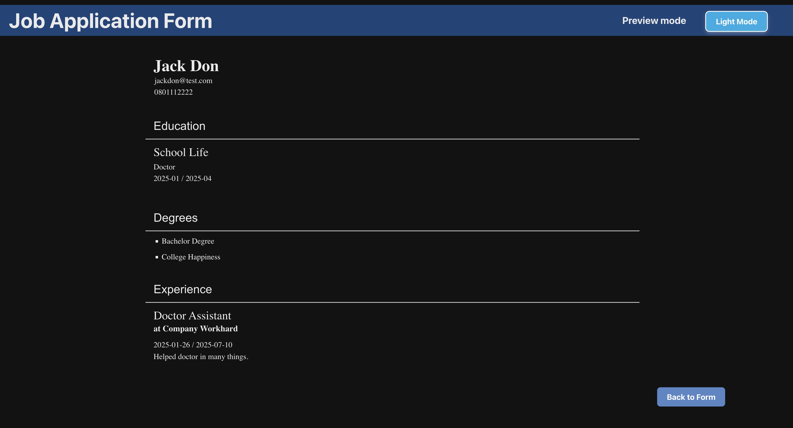

# CV Application

18th project of Odin Project. Create a CV generator form using React with the basic fundamentals learned in the lessons so far.

## Website url

https://aknos2-cv-application.netlify.app/

## Screenshots

## Technologies used

- React
- Javascript
